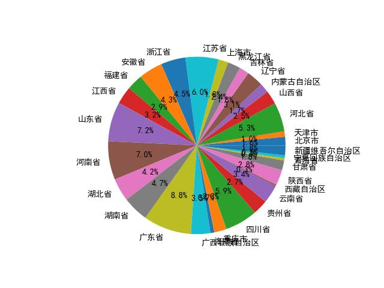
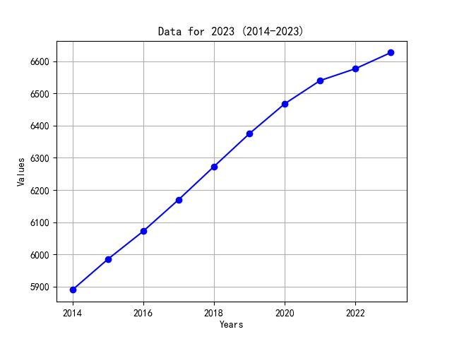

# ZJU_LLM_Project
Course project for ZJU Summer course "LLM Application and Practice" \
Using LLM to generate code, then process, analyze and visualize data. 
## :



- Platform: Windows

## 1. Prepare
- Download koboldcpp at [https://github.com/LostRuins/koboldcpp/releases/tag/v1.74](https://github.com/LostRuins/koboldcpp/releases/tag/v1.74)
- Download Hermes-3-Llama-3.1-8B.Q6_K.GGUF model at [https://huggingface.co/NousResearch/Hermes-3-Llama-3.1-8B-GGUF/tree/main](https://huggingface.co/NousResearch/Hermes-3-Llama-3.1-8B-GGUF/tree/main), then put the model to ``./model``

## 2. Run the project
- To run the whole project:
```shell
python ./run.py
```
- To see the perfect result:
```shell
cd perfect code
python ./run.py
```
Then you should see the result
