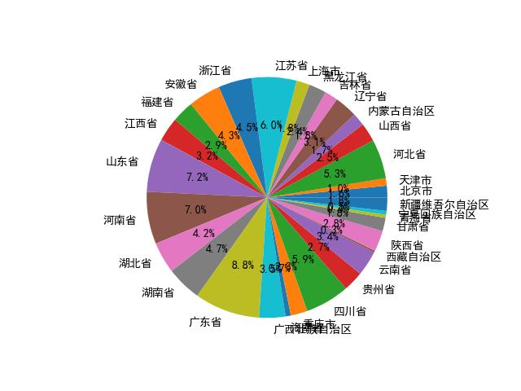
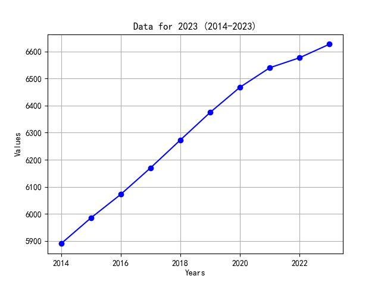
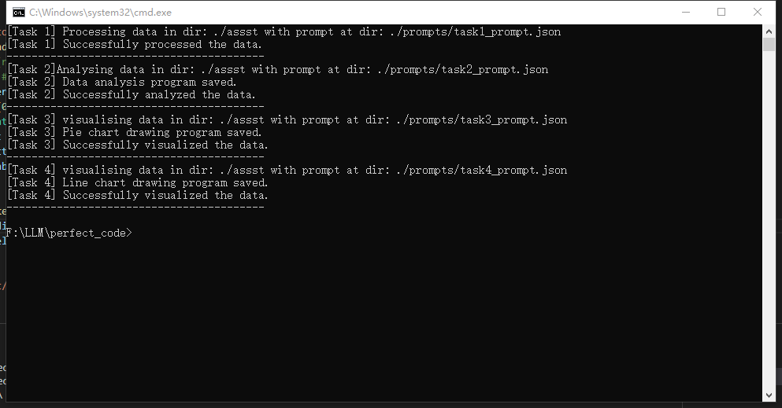

# Assignment 2 Report

|  姓名  |    学号    |    专业    |
| :----: | :--------: | :--------: |
| 姚欣岳 | 3210102379 | 机器人工程 |

## 1. Model

此次作业测试了多个模型


出于以下原因，选择了Hermes-3-Llama-3.1-8B作为使用模型

Yi-coder为专注代码辅助的大模型，但在使用时，生成的代码往往无法使用

Meta-Llama 3.1 虽然参数量大于其他，但是泛化性较强，在生成特定代码下表现不佳，多次实验下稳定性同样欠缺

Sarvam参数量较小，无法达到要求

Hermes参数小，推理时间较快，结果生成较为稳定


## 2. Prompt Design

prompt 在```prompt```文件夹下：


按照任务划分，设计了四个json格式的Prompt，方便直接输入大模型

这里以 task 3生成饼状图 的prompt为例：

```json
{
    "prompt": "Generate another Python code in order to read a file './asset/complete_data.csv', then draw pie chart. You need to get data in the 12th column, and their labels in the first column. In other words, your task is: 1.read file'./asset/complete_data.csv' 2. Collect data with its label, for example: the row '北京' with its average value at 12th column '2187.8' 3.For each data, transform their datatype from string to float write the average value. 4. Draw the pie chart depending on the value. 5. Save the result picture at './asset/pie_chart.jpg'.Notice that your result should only contain the python code, begin with import, end with a print function to print 'end of the code'. Besides, use utf-8-sig as encoding, write 'plt.rcParams['font.family'] = 'SimHei'' at the beginning.",
    "max_length": 300
}
```

其中prompt的主要结构为：

- 概况总体任务；

- 细分具体任务；

- 添加一些格式要求

max_length定义了返回token的数量

## 3. Code Generated by LLM

由于每次跑模型时，生成可执行代码的概率并非100%，这里贴上几个测试过的代码:

#### 1. 处理数据（将txt中的文件去除表头和表尾，写入CSV）

```python
import csv

with open('./asset/常驻人口.txt', 'r', encoding='utf-8') as f:
    lines = f.readlines()

with open('./asset/processed_data.csv', 'w', newline='', encoding='utf-8-sig') as f:
    writer = csv.writer(f)
    for line in lines[3:-2]:
        writer.writerow(line.strip().split(','))
        
```

处理后的数据为

```markdown
地区,2023年,2022年,2021年,2020年,2019年,2018年,2017年,2016年,2015年,2014年
北京市,2186,2184,2189,2189,2190,2192,2194,2195,2188,2171
天津市,1364,1363,1373,1387,1385,1383,1410,1443,1439,1429
河北省,7393,7420,7448,7464,7447,7426,7409,7375,7345,7323
山西省,3466,3481,3480,3490,3497,3502,3510,3514,3519,3528
内蒙古自治区,2396,2401,2400,2403,2415,2422,2433,2436,2440,2449
辽宁省,4182,4197,4229,4255,4277,4291,4312,4327,4338,4358
吉林省,2339,2348,2375,2399,2448,2484,2526,2567,2613,2642
黑龙江省,3062,3099,3125,3171,3255,3327,3399,3463,3529,3608
上海市,2487,2475,2489,2488,2481,2475,2466,2467,2458,2467
江苏省,8526,8515,8505,8477,8469,8446,8423,8381,8315,8281
浙江省,6627,6577,6540,6468,6375,6273,6170,6072,5985,5890
安徽省,6121,6127,6113,6105,6092,6076,6057,6033,6011,5997
福建省,4183,4188,4187,4161,4137,4104,4065,4016,3984,3945
江西省,4515,4528,4517,4519,4516,4513,4511,4496,4485,4480
山东省,10123,10163,10170,10165,10106,10077,10033,9973,9866,9808
河南省,9815,9872,9883,9941,9901,9864,9829,9778,9701,9645
湖北省,5838,5844,5830,5745,5927,5917,5904,5885,5850,5816
湖南省,6568,6604,6622,6645,6640,6635,6633,6625,6615,6611
广东省,12706,12657,12684,12624,12489,12348,12141,11908,11678,11489
广西壮族自治区,5027,5047,5037,5019,4982,4947,4907,4857,4811,4770
海南省,1043,1027,1020,1012,995,982,972,957,945,936
重庆市,3191,3213,3212,3209,3188,3163,3144,3110,3070,3043
四川省,8368,8374,8372,8371,8351,8321,8289,8251,8196,8139
贵州省,3865,3856,3852,3858,3848,3822,3803,3758,3708,3677
云南省,4673,4693,4690,4722,4714,4703,4693,4677,4663,4653
西藏自治区,365,364,366,366,361,354,349,340,330,325
陕西省,3952,3956,3954,3955,3944,3931,3904,3874,3846,3827
甘肃省,2465,2492,2490,2501,2509,2515,2522,2520,2523,2531
青海省,594,595,594,593,590,587,586,582,577,576
宁夏回族自治区,729,728,725,721,717,710,705,695,684,678
新疆维吾尔自治区,2598,2587,2589,2590,2559,2520,2480,2428,2385,2325
```

#### 2. 计算数据平均值，最大最小值并写入文件

```python
import csv
import sys

file_in = open('./asset/processed_data.csv', 'r', encoding='utf-8-sig')
file_out = open('./asset/complete_data.csv', 'w', newline='', encoding='utf-8-sig')
reader = csv.reader(file_in)
writer = csv.writer(file_out)

rows = list(reader)[1:33]  # skip header and read rows 2 to 32

for row in rows:
    data = [float(x) for x in row[1:12]]  # convert columns 2 to 11 to float
    avg = sum(data) / len(data)
    max_val = max(data)
    min_val = min(data)
    row.extend([avg, max_val, min_val])  # add avg, max, min to the row

    writer.writerow(row)

file_in.close()
file_out.close()
```

产生的结果为：

```markdown
北京市,2186,2184,2189,2189,2190,2192,2194,2195,2188,2171,2187.8,2195.0,2171.0
天津市,1364,1363,1373,1387,1385,1383,1410,1443,1439,1429,1397.6,1443.0,1363.0
河北省,7393,7420,7448,7464,7447,7426,7409,7375,7345,7323,7405.0,7464.0,7323.0
山西省,3466,3481,3480,3490,3497,3502,3510,3514,3519,3528,3498.7,3528.0,3466.0
内蒙古自治区,2396,2401,2400,2403,2415,2422,2433,2436,2440,2449,2419.5,2449.0,2396.0
辽宁省,4182,4197,4229,4255,4277,4291,4312,4327,4338,4358,4276.6,4358.0,4182.0
吉林省,2339,2348,2375,2399,2448,2484,2526,2567,2613,2642,2474.1,2642.0,2339.0
黑龙江省,3062,3099,3125,3171,3255,3327,3399,3463,3529,3608,3303.8,3608.0,3062.0
上海市,2487,2475,2489,2488,2481,2475,2466,2467,2458,2467,2475.3,2489.0,2458.0
江苏省,8526,8515,8505,8477,8469,8446,8423,8381,8315,8281,8433.8,8526.0,8281.0
浙江省,6627,6577,6540,6468,6375,6273,6170,6072,5985,5890,6297.7,6627.0,5890.0
安徽省,6121,6127,6113,6105,6092,6076,6057,6033,6011,5997,6073.2,6127.0,5997.0
福建省,4183,4188,4187,4161,4137,4104,4065,4016,3984,3945,4097.0,4188.0,3945.0
江西省,4515,4528,4517,4519,4516,4513,4511,4496,4485,4480,4508.0,4528.0,4480.0
山东省,10123,10163,10170,10165,10106,10077,10033,9973,9866,9808,10048.4,10170.0,9808.0
河南省,9815,9872,9883,9941,9901,9864,9829,9778,9701,9645,9822.9,9941.0,9645.0
湖北省,5838,5844,5830,5745,5927,5917,5904,5885,5850,5816,5855.6,5927.0,5745.0
湖南省,6568,6604,6622,6645,6640,6635,6633,6625,6615,6611,6619.8,6645.0,6568.0
广东省,12706,12657,12684,12624,12489,12348,12141,11908,11678,11489,12272.4,12706.0,11489.0
广西壮族自治区,5027,5047,5037,5019,4982,4947,4907,4857,4811,4770,4940.4,5047.0,4770.0
海南省,1043,1027,1020,1012,995,982,972,957,945,936,988.9,1043.0,936.0
重庆市,3191,3213,3212,3209,3188,3163,3144,3110,3070,3043,3154.3,3213.0,3043.0
四川省,8368,8374,8372,8371,8351,8321,8289,8251,8196,8139,8303.2,8374.0,8139.0
贵州省,3865,3856,3852,3858,3848,3822,3803,3758,3708,3677,3804.7,3865.0,3677.0
云南省,4673,4693,4690,4722,4714,4703,4693,4677,4663,4653,4688.1,4722.0,4653.0
西藏自治区,365,364,366,366,361,354,349,340,330,325,352.0,366.0,325.0
陕西省,3952,3956,3954,3955,3944,3931,3904,3874,3846,3827,3914.3,3956.0,3827.0
甘肃省,2465,2492,2490,2501,2509,2515,2522,2520,2523,2531,2506.8,2531.0,2465.0
青海省,594,595,594,593,590,587,586,582,577,576,587.4,595.0,576.0
宁夏回族自治区,729,728,725,721,717,710,705,695,684,678,709.2,729.0,678.0
新疆维吾尔自治区,2598,2587,2589,2590,2559,2520,2480,2428,2385,2325,2506.1,2598.0,2325.0

```

#### 3. 绘制人口平均数饼状图

```python
import csv
import matplotlib.pyplot as plt
plt.rcParams['font.family'] = 'SimHei'

# 读取文件并处理数据
with open('./asset/complete_data.csv', 'r', encoding='utf-8-sig') as f:
    reader = csv.reader(f)
    # header = next(reader)  # 跳过标题行
    data_dict = {}  # 保存数据的字典
    for row in reader:
        label = row[0]
        value = float(row[11])  # 读取第12列数据并转换为浮点数
        if label not in data_dict:
            data_dict[label] = []
        data_dict[label].append(value)

# 画图
labels = data_dict.keys()
values = [sum(data_dict[label]) for label in labels]
plt.pie(values, labels=labels, autopct='%.1f%%')

# 保存图像
plt.savefig('./asset/pie_chart.jpg')
plt.show()
```

输出的结果图像为：



#### 4. 绘制浙江省折线图

```python
import csv
import matplotlib.pyplot as plt
plt.rcParams['font.family'] = 'SimHei'

def find_and_plot():
    with open('./asset/processed_data.csv', newline='', encoding='utf-8') as csvfile:
        reader = csv.reader(csvfile)
        for row in reader:
            if row[0] == '浙江省':
                data = row[1:11]
                data = [float(i) for i in data]
                years = list(range(2023, 2013, -1))
                plt.plot(years, data, marker='o', linestyle='-', color='b')
                plt.xlabel('Years')
                plt.ylabel('Values')
                plt.title('Data for 浙江省 (2014-2023)')
                plt.grid(True)
                plt.show()
                break

find_and_plot()
```

输出的结果为：




## 4. Code Execution

首先为整个项目编写一个脚本 ```run.py```用于同时启动大模型和agent程序```Agent.py```：

```python
import subprocess
import time

# 打开一个终端并运行第一个命令
def run_command_in_terminal(command):
    # 在 Windows 上，你可以使用 'cmd' 或 'powershell'
    process = subprocess.Popen(['cmd', '/c', 'start', 'cmd', '/k', command])
    return process

def main():
    # 第一个终端命令
    command1 = '.\koboldcpp.exe .\models\Hermes-3-Llama-3.1-8B.Q4_K_M.gguf'
    process1 = run_command_in_terminal(command1)
    
    time.sleep(20) 

    # 第二个终端命令
    command2 = 'python Agent.py'
    process2 = run_command_in_terminal(command2)

    # 等待两个进程结束
    process1.wait()
    process2.wait()

if __name__ == '__main__':
    main()

```

直接在shell中执行

```shell
python ./run.py
```

如果一切顺利，输出的结果如下：



但现实情况是，经过多次尝试，由于任务2和任务3生成代码可执行的概率约为50%，所以上述代码一次性执行，生成可用代码以及结果的概率极低。于是在 ```perfect_code``` 文件夹下附了以上生成的可以完美执行的代码，通过运行

```shell
cd perfect_code
python run.py
```

便可以看到完美执行后的效果。

